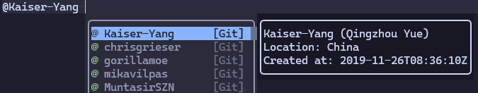

# blink-cmp-git

Git source for [blink.cmp](https://github.com/Saghen/blink.cmp)
completion plugin. This makes it possible to query pull requests, issues,
and users from GitHub or GitLab. This is very useful when you are writing a commit with `nvim`.

Use `#` to search for issues and pull requests (`!` for `gitlab`'s merge requests):


Use `:` to search for commits:


Use `@` to search for users:



## Requirements

`git` is required for default configurations.

`gh` is required for the `github` related features.

`glab` is required for the `gitlab` related features.

Run `checkhealth blink-cmp-git` to check the requirements.

## Installation

Add the plugin to your packer managers, and make sure it is loaded before `blink.cmp`.

### `lazy.nvim`

```lua
{
    'saghen/blink.cmp',
    dependencies = {
        {
            'Kaiser-Yang/blink-cmp-git',
            dependencies = { 'nvim-lua/plenary.nvim' }
        }
        -- ... other dependencies
    },
    opts = {
        sources = {
            -- add 'git' to the list
            default = { 'git', 'dictionary', 'lsp', 'path', 'luasnip', 'buffer' },
            providers = {
                git = {
                    module = 'blink-cmp-git',
                    name = 'Git',
                    opts = {
                        -- options for the blink-cmp-git
                    },
                },
            }
        }
    }
}
```

## Quick Start

```lua
git = {
    module = 'blink-cmp-git',
    name = 'Git',
    -- only enable this source when filetype is gitcommit, markdown, or 'octo'
    enabled = function()
        return vim.tbl_contains({ 'octo', 'gitcommit', 'markdown' }, vim.bo.filetype)
    end,
    --- @module 'blink-cmp-git'
    --- @type blink-cmp-git.Options
    opts = {
        commit = {
            -- You may want to customize when it should be enabled
            -- The default will enable this when `git` is found and `cwd` is in a git repository
            -- enable = function() end
            -- You may want to change the triggers
            -- triggers = { ':' },
        }
        git_centers = {
            github = {
                -- Those below have the same fields with `commit`
                -- Those features will be enabled when `git` and `gh` (or `curl`) are found and
                -- remote contains `github.com`
                -- issue = {
                --     get_token = function() return '' end,
                -- },
                -- pull_request = {
                --     get_token = function() return '' end,
                -- },
                -- mention = {
                --     get_token = function() return '' end,
                --     get_documentation = function(item)
                --         local default = require('blink-cmp-git.default.github')
                --             .mention.get_documentation(item)
                --         default.get_token = function() return '' end
                --         return default
                --     end
                -- }
            },
            gitlab = {
                -- Those below have the same fields with `commit`
                -- Those features will be enabled when `git` and `glab` (or `curl`) are found and
                -- remote contains `gitlab.com`
                -- issue = {
                --     get_token = function() return '' end,
                -- },
                -- NOTE:
                -- Even for `gitlab`, you should use `pull_request` rather than`merge_request`
                -- pull_request = {
                --     get_token = function() return '' end,
                -- },
                -- mention = {
                --     get_token = function() return '' end,
                --     get_documentation = function(item)
                --         local default = require('blink-cmp-git.default.gitlab')
                --            .mention.get_documentation(item)
                --         default.get_token = function() return '' end
                --         return default
                --     end
                -- }
            }
        }
    }
},
```

The configuration above will enable the `blink-cmp-git` for `blink.cmp` and show the items
when the file's type is `gitcommit` or `markdown`. By default, `blink-cmp-git` will pre-cache
everything when it is created. To enable `blink-cmp-git` all the time makes it possible to
pre-cache when you enter insert mode or other mode you can input
(`blink.cmp` will create sources when you can input something).

> [!NOTE]
> The default configuration will use `curl` when `gh` or `glab` is not found.
>
> For `github` users, if you customize the `get_token`, you should see those below to know
> which permissions are required:
>
> * [commit (for `octo.nvim` users)](https://docs.github.com/en/rest/commits/commits?apiVersion=2022-11-28#list-commits)
> * [issue](https://docs.github.com/en/rest/issues/issues?apiVersion=2022-11-28#list-repository-issues)
> * [pull-request](https://docs.github.com/en/rest/pulls/pulls?apiVersion=2022-11-28#list-pull-requests)
> * [mention](https://docs.github.com/en/rest/repos/repos?apiVersion=2022-11-28#list-repository-contributors)
>
> For `gitlab` users, see [PAT](https://docs.gitlab.com/ee/user/profile/personal_access_tokens.html)
> to know how to get the token.

> [!NOTE]
> For [octo.nvim](https://github.com/pwntester/octo.nvim) users, `blink-cmp-git` supports it.
> By default, when you are in a `octo` file, `blink-cmp-git` will use the `octo`'s
> path to get the `owner` and `repo` to fetch the items.

## Reload Cache

There are many cases will make the cache out of date. For example,
if your `cwd` is in a repository, later you switch your `cwd` to another repository, the cache
will use the first repository's result. To solve this problem, there is a command to
reload the cache: `BlinkCmpGitReloadCache`. This command will clear all the cache and if
`use_items_pre_cache` is enabled (default to `true`), it will pre-cache again.

`blink-cmp-git` will create a auto command which uses `should_reload_cache` to determine
whether or not to reload cache when entering insert mode.
The default `should_reload_cache` will return `true` when detecting another `git` repository
from `octo` or `cwd`.

> [!NOTE]
>
> The command will be available only when the `blink-cmp-git` source is created. Usually,
> the source will be created when it is enabled and you are in some mode you can input.

## Default Configuration

See [default.lua](./lua/blink-cmp-git/default/init.lua).

## FAQs

### How to customize the completion items?

Because all features have same fields, I'll use `commit` as an example.

The `blink-cmp-git` will first run command from `get_command` and `get_command_args`. The standout
of the command will be passed to `separate_output`. So if you want to customize the completion 
items, you should be aware of what the output of your command looks like.

In most situations, you just need to customize
`get_label`, `get_kind_name`, `get_insert_text` and `get_documentation`. Before you customize them,
you should be aware of what the item looks like. See [item](/doc/item/) to know what them look like.
The commit item looks like this below:

```gitcommit
commit 0216336d8ff00d7b8c9304b23bcca31cbfcdf2c8
Author:     Kaiser-Yang <624626089@qq.com>
AuthorDate: Sun Jan 12 14:40:38 2025 +0800
Commit:     Kaiser-Yang <624626089@qq.com>
CommitDate: Sun Jan 12 14:43:15 2025 +0800

    Cache empty documentations

```

The default getters for `commit`:

```lua
git_centers = {
    commit = {
        -- use the first 7 hash and the first line of the commit message as the label
        get_label = function(item)
            return item:match('commit ([^\n]*)'):sub(1, 7) .. ' ' .. item:match('\n\n%s*([^\n]*)')
        end,
        -- use 'Commit' as the kind name
        get_kind_name = function(_)
            return 'Commit'
        end,
        -- use the first 7 hash as the insert text
        get_insert_text = function(item)
            return item:match('commit ([^\n]*)'):sub(1, 7)
        end,
        -- use the whole commit message as the documentation
        get_documentation = function(item)
            return item
            -- or you can use `blink-cmp-git.DocumentationCommand` to get the documentation
            -- return {
            --     -- the command to get the documentation
            --     get_command = '',
            --     get_command_args = {}
            --     -- how to resolve the output
            --     resolve_documentation = function(output) return output end
            -- }
            -- or return nil to disable the documentation
            -- return nil
        end,
    }
}
```

> [!NOTE]
>
> `kind_name` is used by those default options:
>
> * `kind_icons`
>
> Therefore, if you customize the `kind_name`, you should customize them too.

### How to customize the error message?

From the version `v0.2.0`, there is a configuration `on_error` for all the `GCSCompletionOptions`.
`on_error` is a function like `func(return_value: number, standard_error: string): boolean`.

When `blink-cmp-git` find a non-zero return value or a non-empty standard error, it will call
`on_error` with the return value and the standard error. If `on_error` returns `false`, the error
will be ignored, which means `blink-cmp-git` will go on to the next step. When `on_error` returns
`true`, `blink-cmp-git` will not go on to the next step. The default `on_error` is to show the
error message and return `true`.

For example, if you want to disable the error message for `commit`,
you just need to use those below:

```lua
commit = {
    on_error = function(_, _) return true end
}
```

### How to remove trailing white spaces?

By default, `blink-cmp-git` adds a space for every item when you select or accept it. If you don't
want this, you can configure the `insert_text_trailing` for each feature. For example, those below
will remove the trailing white spaces for `commit`:

```lua
commit = {
    -- or you can update it to other contents such as '\n'
    insert_text_trailing = ''
}
```

### How to customize the highlight?

Since `v0.3.0`, the completion items' kind will be determined by the `kind_name` field from the
`separate_output` function. From the documentation of `blink.cmp`, `BlinkCmpKind<kind_name>` is
available for you to customize the highlight. By default, `blink-cmp-git` will use the
`BlinkCmpKind` for all the kinds. If you want to customize the highlight for `commit`, you can use
those below:

```lua
-- `Commit` is from the `get_kind_name` function
-- The `kind_name` for default are `Commit`, `Issue`, `PR`, `MR` and 'Mention'.
-- If you customize the `separate_output`, you should update `Commit` with your `kind_name`
vim.api.nvim_set_hl(0, 'BlinkCmpKind' .. 'Commit', { default = false, fg = '#a6e3a1' })
```

### How to customize different icons for open, closed, and merged pull requests or issues?

By default, `blink-cmp-git` will only fetch the open pull requests or issues. So you should
customize the `api` parameters to fetch all states.
See [How to customize the APIs?](#how-to-customize-the-apis).

Firstly, you should update the `get_kind_name` to customize the `kind_name`:

```lua
git_centers = {
    github = {
        pull_request = {
            get_kind_name = function(item)
                -- openPR, closedPR, mergedPR, draftPR, lockedPR
                return item.locked and 'lockedPR' or
                    item.draft and 'draftPR' or
                    item.merged_at and 'mergedPR' or
                    item.state .. 'PR'
            end,
        },
        issue = {
            get_kind_name = function(item)
                -- openIssue, reopenedIssue, completedIssue
                -- not_plannedIssue, lockedIssue, duplicateIssue
                return item.locked and 'lockedIssue' or
                    (item.state_reason or item.state) .. 'Issue'
            end,
        },
    },
    gitlab = {
        pull_request = {
            get_kind_name = function(item)
                -- openedPR, closedPR, mergedPR, draftPR, lockedPR
                return item.discussion_locked and 'lockedPR' or
                    item.draft and 'draftPR' or
                    item.state .. 'PR'
            end,
        },
        issue = {
            get_kind_name = function(item)
                -- openedIssue, closedIssue
                return item.discussion_locked and 'lockedIssue' or
                    item.state .. 'Issue'
            end,
        },
    }
}
```

Then, you should update the icon for the `kind_name`:

```lua
kind_icons = {
    openPR = '',
    openedPR = '',
    closedPR = '',
    mergedPR = '',
    draftPR = '',
    lockedPR = '',
    openIssue = '',
    openedIssue = '',
    reopenedIssue = '',
    completedIssue = '',
    closedIssue = '',
    not_plannedIssue = '',
    duplicateIssue = '',
    lockedIssue = '',
}
```

You may need to update the highlight for the `kind_name`,
see [How to customize the highlight?](#how-to-customize-the-highlight). Here is an example for
`github`-like icons' highlight:

```lua
local blink_cmp_kind_name_highlight = {
    Commit = { default = false, fg = '#a6e3a1' },
    Mention = { default = false, fg = '#a6e3a1' },
    openPR = { default = false, fg = '#a6e3a1' },
    openedPR = { default = false, fg = '#a6e3a1' },
    closedPR = { default = false, fg = '#f38ba8' },
    mergedPR = { default = false, fg = '#cba6f7' },
    draftPR = { default = false, fg = '#9399b2' },
    lockedPR = { default = false, fg = '#f5c2e7' },
    openIssue = { default = false, fg = '#a6e3a1' },
    openedIssue = { default = false, fg = '#a6e3a1' },
    reopenedIssue = { default = false, fg = '#a6e3a1' },
    completedIssue = { default = false, fg = '#cba6f7' },
    closedIssue = { default = false, fg = '#cba6f7' },
    not_plannedIssue = { default = false, fg = '#9399b2' },
    duplicateIssue = { default = false, fg = '#9399b2' },
    lockedIssue = { default = false, fg = '#f5c2e7' },
}
for kind_name, hl in pairs(blink_cmp_kind_name_highlight) do
    vim.api.nvim_set_hl(0, 'BlinkCmpKind' .. kind_name, hl)
end
```

You may also need to update the `configure_score_offset`, otherwise the default may not work as you
expected. There is an example:

```lua
local function pr_or_issue_configure_score_offset(items)
    -- Bonus to make sure items sorted as below:
    local keys = {
        -- place `kind_name` here
        { 'openIssue',     'openedIssue', 'reopenedIssue' },
        { 'openPR',        'openedPR' },
        { 'lockedIssue',   'lockedPR' },
        { 'completedIssue' },
        { 'draftPR' },
        { 'mergedPR' },
        { 'closedPR',      'closedIssue', 'not_plannedIssue', 'duplicateIssue' },
    }
    local bonus = 999999
    local bonus_score = {}
    for i = 1, #keys do
        for _, key in ipairs(keys[i]) do
            bonus_score[key] = bonus * (#keys - i)
        end
    end
    for i = 1, #items do
        local bonus_key = items[i].kind_name
        if bonus_score[bonus_key] then
            items[i].score_offset = bonus_score[bonus_key]
        end
        -- sort by number when having the same bonus score
        local number = items[i].label:match('[#!](%d+)')
        if number then
            if items[i].score_offset == nil then
                items[i].score_offset = 0
            end
            items[i].score_offset = items[i].score_offset + tonumber(number)
        end
    end
end

git_centers = {
    github = {
        pull_request = {
            configure_score_offset = pr_or_issue_configure_score_offset,
        },
        issue = {
            configure_score_offset = pr_or_issue_configure_score_offset,
        },
    },
    gitlab = {
        pull_request = {
            configure_score_offset = pr_or_issue_configure_score_offset,
        },
        issue = {
            configure_score_offset = pr_or_issue_configure_score_offset,
        },
    }
}
```

### How to customize for enterprise `github` or `gitlab`?

See [how to customize the APIs](#how-to-customize-the-apis).

### How to customize the APIs?

By default, `blink-cmp-git` will request those endpoints below:

| Feature                            | API Endpoint                         |
|------------------------------------|--------------------------------------|
| `github.issue`                     | `repos/OWNER/REPO/issues`            |
| `github.pull_request`              | `repos/OWNER/REPO/pulls`             |
| `github.mention`                   | `repos/OWNER/REPO/contributors`      |
| `github.mention.get_documentation` | `users/USERNAME`                     |
| `gitlab.issue`                     | `projects/PROJECT_ID/issues`         |
| `gitlab.pull_request`              | `projects/PROJECT_ID/merge_requests` |
| `gitlab.mention`                   | `projects/PROJECT_ID/users`          |
| `gitlab.mention.get_documentation` | `users/USERID`                       |

You can see
[github rest API](https://docs.github.com/en/rest)
and
[gitlab rest API](https://docs.gitlab.com/ee/api/rest/) to know what the available parameters are.

I'll give you an example for `github.issue` to customize `per_page` and `sort`:

```lua
git_centers = {
    github = {
        issue = {
            get_command_args = function(command, token)
                -- Get the default args
                local args = require('blink-cmp-git.default.github')
                    .issue
                    .get_command_args(command, token)
                local utils = require('blink-cmp-git.utils')
                -- The last element is the API endpoint, customize it
                if command == 'curl' then
                    -- You can update the `github.com` to your enterprise's domain
                    args[#args] = 'https://api.github.com/repos/' ..
                        -- NOTE:
                        -- for `gitlab` users, you should use `utils.get_repo_owner_and_repo(true)`
                        utils.get_repo_owner_and_repo() ..
                        '/issues?state=all&per_page=100&sort=updated'
                else
                    args[#args] = 'repos/' ..
                        -- NOTE:
                        -- for `gitlab` users, you should use `utils.get_repo_owner_and_repo(true)`
                        utils.get_repo_owner_and_repo() ..
                        '/issues?state=all&per_page=100&sort=updated'
                    -- use those below to customize the enterprise's domain
                    -- table.insert(args, '--hostname')
                    -- table.insert(args, 'github.com')
                end
                return args
            end,
        }
    }
}
```

> [!NOTE]
> For `github`, the `per_page` has a maximum of `100`.
> See [github-discussion-comment](https://github.com/orgs/community/discussions/9868#discussioncomment-1943095).

## How to auto reload cache when opening a file from a different repository?

By default, `blink-cmp-git` will reload the cache when the result of `get_cwd` is changed to
another repository.

The default `get_cwd` is `vim.fn.getcwd`. If you want to reload the cache
when opening a file from a different repository, you just need to update the `get_cwd` function.
For example:

```lua
get_cwd = function()
    -- return the directory of the current file
    return vim.fn.expand('%:p:h')
end
```

## Performance

Once `async` is enabled, the completion will has no effect to your other operations.
How long it will take to show results depends on the network speed and the response time
of the git center. But, don't worries, once you enable `use_items_cache`, the items will be
cached when you first trigger the completion by inputting `@`, `#`, or `:`
(You can DIY the triggers). Furthermore, once you enable `use_items_pre_cache`, when the
source is created, it will pre-cache all the items. For the documentation of `mention` feature,
it will be cached when you hover on one item.

## Version Introduction

The release versions are something like `major.minor.patch`. When one of these numbers is increased:

* `patch`: bugs are fixed or docs are added. This will not break the compatibility.
* `minor`: compatible features are added. This may cause some configurations `deprecated`, but
not break the compatibility.
* `major`: incompatible features are added. All the `deprecated` configurations will be removed.
This will break the compatibility.

## Acknowledgment

Nice and fast completion plugin: [blink.cmp](https://github.com/Saghen/blink.cmp).

Inspired by [cmp-git](https://github.com/petertriho/cmp-git).
