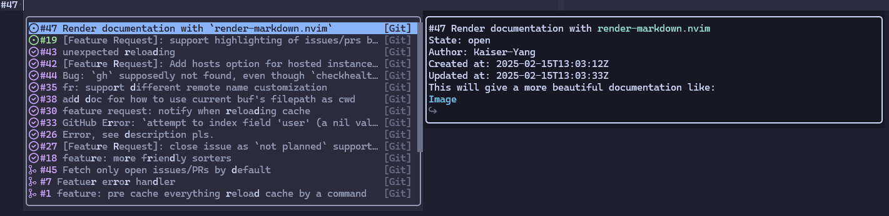

# blink-cmp-git

Git source for [blink.cmp](https://github.com/Saghen/blink.cmp)
completion plugin. This makes it possible to query pull requests, issues,
and users from GitHub. This is very useful when you are writing a commit with `nvim`.

Use `#` to search for issues and pull requests:



Use `:` to search for commits:


Use `@` to search for users:


## Requirements

`gh` is required for the default configuration.

## Installation

Add the plugin to your packer managers, and make sure it is loaded before `blink.cmp`.

### `lazy.nvim`

```lua
{
    'saghen/blink.cmp',
    dependencies = {
        {
            'Kaiser-Yang/blink-cmp-git',
            dependencies = { 'nvim-lua/plenary.nvim' }
        }
        -- ... other dependencies
    },
    opts = {
        sources = {
            -- add 'git' to the list
            default = { 'git', 'dictionary', 'lsp', 'path', 'luasnip', 'buffer' },
            providers = {
                git = {
                    module = 'blink-cmp-git',
                    name = 'Git',
                    opts = {
                        -- options for the blink-cmp-git
                    },
                },
            }
        }
    }
}
```

## Quick Start

```lua
git = {
    module = 'blink-cmp-git',
    name = 'Git',
    -- Because we use filetype to decide whether or not to show the items,
    -- we can make the score higher
    score_offset = 100,
    -- enabled this source at the beginning to make it possible to pre-cache
    -- at very beginning
    enabled = true,
    -- only show this source when filetype is gitcommit or markdown
    should_show_items = function()
        return vim.o.filetype == 'gitcommit' or vim.o.filetype == 'markdown'
    end,
    --- @module 'blink-cmp-git'
    --- @type blink-cmp-git.Options
    opts = {
        commit = {
            -- You may want to customize when it should be enabled
            -- The default will enable this when `git` is found and `cwd` is in a git repository
            -- enable = function() end
            -- You may want to change the triggers
            -- triggers = { ':' },
        }
        git_centers = {
            github = {
                -- Those below have the same fields with `commit`
                -- Those features will be enabled when `git` and `gh` are found and
                -- remote contains `github.com`
                -- issue = {
                -- },
                -- pull_request = {
                -- },
                -- mention = {
                -- }
            }
        }
    }
},
```

The configuration above will enable the `blink-cmp-git` for `blink.cmp` and show the items
when the filetype is `gitcommit` or `markdown`. By default, `blink-cmp-git` will pre-cache
everything when it is created. To enable `blink-cmp-git` all the time makes it possible to
pre-cache when you enter insert mode or other mode you can input
(`blink.cmp` will create sources when you can input something).

## Reload Cache

There are many cases will make the cache out of date. For example,
if your `cwd` is in a repository, later you switch your `cwd` to another repository, the cache
will use the first repository's result. To solve this problem, there is a command to
reload the cache: `BlinkCmpGitReloadCache`. This command will clear all the cache and if
`use_items_pre_cache` is enabled (default to `true`), it will pre-cache again.

You can bind the command to a key or create a vim autocommand to reload the cache when your
`cwd` changes.

> [!NOTE]
>
> The command will be available only when the `blink-cmp-git` source is created. Usually,
> the source will be created when it is enabled and you are in some mode you can input.

> [!NOTE]
>
> Since `v0.3.0`, `blink-cmp-git` will create a auto command which uses
> `should_reload_cache` to determine whether or not to reload cache when entering a buffer.
> The default `should_reload_cache` will return `true` when `cwd` changed to another
> `git` repository.

## Default Configuration

See [default.lua](./lua/blink-cmp-git/default.lua).

## FAQs

### How to customize the completion items?

Because all features have same fields, I'll use `commit` as an example.

The `blink-cmp-git` will first run command from `get_command` and `get_command_args`. The standout
of the command will be passed to `separate_output`. So if you want to customize the completion items,
you should be aware of what the output of your command looks like.

The default `get_command` and `get_command_args` for `commit`:

```lua
get_command = 'git',
get_command_args = {
    '--no-pager',
    'log',
    '--pretty=fuller',
    '--decorate=no',
},
```

This will give you the output like:

```gitcommit
commit 0216336d8ff00d7b8c9304b23bcca31cbfcdf2c8
Author:     Kaiser-Yang <624626089@qq.com>
AuthorDate: Sun Jan 12 14:40:38 2025 +0800
Commit:     Kaiser-Yang <624626089@qq.com>
CommitDate: Sun Jan 12 14:43:15 2025 +0800

    Cache empty documentations

commit 90e2fd0f5ae6e4de00eab63f5cb99f850e0ffa56
Author:     Kaiser-Yang <624626089@qq.com>
AuthorDate: Sun Jan 12 14:27:39 2025 +0800
Commit:     Kaiser-Yang <624626089@qq.com>
CommitDate: Sun Jan 12 14:27:39 2025 +0800

    Improve the experience of pre cache
...
```

The default `separate_output` for `commit`:

```lua
separate_output = function(output)
    local lines = vim.split(output, '\n')
    local i = 1
    local commits = {}
    -- Those below separate the output to a list of commits
    -- I've tried use regex to match the commit, but there always were missing some commits
    while i < #lines do
        local j = i + 1
        while j < #lines do
            if lines[j]:match('^commit ') then
                j = j - 1
                break
            end
            j = j + 1
        end
        commits[#commits + 1] = table.concat(lines, '\n', i, j)
        i = j + 1
    end
    --- @type blink-cmp-git.CompletionItem[]
    local items = {}
    ---@diagnostic disable-next-line: redefined-local
    for i = 1, #commits do
        --- @type string
        local commit = commits[i]
        items[i] = {
            -- label is what to show in the completion menu
            -- the first 7 characters of the hash and the subject of the commit
            label =
                commit:match('commit ([^\n]*)'):sub(1, 7)
                ..
                ' '
                ..
                commit:match('\n\n%s*([^\n]*)'),
            kind_name = 'Commit',
            -- insert_text is what to insert when you select or accept the item
            insert_text = commit:match('^commit ([^\n]*)'):sub(1, 7) .. ' ',
            -- this can be a `DocumentationCommand` or a string
            -- set this to nil if you don't want to show the documentation
            -- use the whole commit as the documentation
            documentation = commit
            -- documentation = {
            --     -- the command to get the documentation
            --     get_command = '',
            --     get_command_args = {}
            --     -- how to resolve the output
            --     resolve_documentation = function(output) return output end
            -- }
            -- documentation = nil
        }
    end
    return items
end,
```

### How to customize the error message?

From the version `v0.2.0`, there is a configuration `on_error` for all the `GCSCompletionOptions`.
`on_error` is a function like `func(return_value: number, standard_error: string): boolean`.

When `blink-cmp-git` find a non-zero return value or a non-empty standard error, it will call
`on_error` with the return value and the standard error. If `on_error` returns `false`, the error
will be ignored, which means `blink-cmp-git` will go on to the next step. When `on_error` returns
`true`, `blink-cmp-git` will not go on to the next step. The default `on_error` is to show the
error message and return `true`.

For example, if you want to disable the error message for `commit`,
you just need to use those below:

```lua
commit = {
    on_error = function(_, _) return true end
}
```

### How to remove trailing white spaces?

By default, `blink-cmp-git` add a space for every item when you select or accept it. If you don't
want this, you can configure the `insert_text_trailing` for each feature. For example, those below
will remove the trailing white spaces for `commit`:

```lua
commit = {
    -- or you can update it to other contents such as '\n'
    insert_text_trailing = ''
}
```

### How to customize the highlight?

Since `v0.3.0`, the completion items' kind will be determined by the `kind_name` field from the
`separate_output` function. From the documentation of `blink.cmp`, `BlinkCmpKind<kind_name>` is
available for you to customize the highlight. By default, `blink-cmp-git` will use the
`BlinkCmpKind` for all the kinds. If you want to customize the highlight for `commit`, you can use
those below:

```lua
-- Commit is from the `separate_output` function
-- The `kind_name` for default `separate_output` are `Commit`, `Issue`, `PR`.
-- If you customize the `separate_output`, you should update `Commit` with your `kind_name`
vim.api.nvim_set_hl(0, 'BlinkCmpKind' .. 'Commit', { default = false, bg = 'red' })
```

### How to customize different icons for open, closed, and merged pull requests or issues?

I'll give you the example for pull requests. You can do the same for issues.

Firstly, you should update the `get_command_args` to get all states of the pull requests or issues:

```lua
git_centers = {
    github = {
        pull_request = {
                get_command_args = {
                    'pr',
                    'list',
                    '--state', 'all', -- get all pull requests
                    '--json', 'number,title,state,body,createdAt,updatedAt,closedAt,author',
                },
            },
        }
    }
}
```

Secondly, you should update the `separate_output` to customize the `kind_name`:

```lua
git_centers = {
    github = {
        pull_request = {
            separate_output = function(output)
                --- @type blink-cmp-git.CompletionItem[]
                local items = {}
                local json_res = vim.json.decode(output)
                for i = 1, #json_res do
                    items[i] = {
                        label = '#' .. tostring(json_res[i].number) ..
                            ' ' .. tostring(json_res[i].title),
                        insert_text = '#' .. tostring(json_res[i].number),
                        -- PROPEN
                        -- PRCLOSED
                        -- PRMERGED
                        kind_name = 'PR' .. tostring(json_res[i].state),
                        documentation =
                            '#' .. tostring(json_res[i].number) ..
                            ' ' .. tostring(json_res[i].title) .. '\n' ..
                            'State: ' .. tostring(json_res[i].state) .. '\n' ..
                            'Author: ' .. tostring(json_res[i].author.login) .. '\n' ..
                            'Created at: ' .. tostring(json_res[i].createdAt) .. '\n' ..
                            'Updated at: ' .. tostring(json_res[i].updatedAt) .. '\n' ..
                            'Closed at: ' .. tostring(json_res[i].closedAt) .. '\n' ..
                            tostring(json_res[i].body)
                    }
                end
                return items
            end,
        }
    }
}
```

At last, you should update the icon for the `kind_name`:

```lua
kind_icons = {
    PROPEN = '',
    PRCLOSED = '',
    PRMERGED = '',
}
```

You may need to update the highlight for the `kind_name`,
see [How to customize the highlight?](#how-to-customize-the-highlight).

## Performance

Once `async` is enabled, the completion will has no effect to your other operations.
How long it will take to show results depends on the network speed and the response time
of the git center. But, don't worries, once you enable `use_items_cache`, the items will be
cached when you first trigger the completion by inputting `@`, `#`, or `:`
(You can DIY the triggers). Furthermore, once you enable `use_items_pre_cache`, when the
source is created, it will pre-cache all the items. For the documentation of `mention` feature,
it will be cached when you hover on one item.

## Version Introduction

The release versions are something like `major.minor.patch`. When one of these numbers is increased:

* `patch`: bugs are fixed or docs are added. This will not break the compatibility.
* `minor`: compatible features are added. This may cause some configurations `deprecated`, but
not break the compatibility.
* `major`: incompatible features are added. All the `deprecated` configurations will be removed.
This will break the compatibility.

## Acknowledgment

Nice and fast completion plugin: [blink.cmp](https://github.com/Saghen/blink.cmp).

Inspired by [cmp-git](https://github.com/petertriho/cmp-git).
